# Projeto Integrador - Implantação de Infraestrutura de TI

**Empresa:** Zetta

**Slogan:** Soluções tecnológicas e suporte em TI.

  

Alunos: Nicolas, Anna, Rafael, Sara, Gabriel M., Levy.

---

## 📝 Sobre a Empresa

### Missão
Nossa missão é alinhar processos, blindar servidores e garantir o fluxo contínuo de dados, entregando um suporte em TI tão fluido, inteligente e sob medida que se torna invisível no dia a dia dos nossos parceiros.

### Visão
Ser a principal referência em terceirização e infraestrutura de TI para empresas prestadoras de serviços, alcançando a marca de 100% de disponibilidade dos ambientes gerenciados e expandindo nossa operação com soluções automatizadas e alta retenção de clientes.

### Organograma Simplificado

* **Diretoria:** CEO e CTO
* **Administrativo / Financeiro:** RH e Faturamento
* **Recepção:** Atendimento Inicial e Triagem
* **Suporte Técnico / Operações:** Analistas de Infraestrutura, Redes e Helpdesk

**Quantidade de Funcionários:** 15 colaboradores.

### Planta Baixa do Escritório

  

---

## 👥 Integrantes do Grupo e Funções (Kanban)

* **[Nicolas e Anna]** - Scrum Master & Sysadmin Windows (Active Directory, DNS, DHCP e GPOs).
* **[Gabriel Monteiro e Sara]** - Sysadmin Linux & DevOps (Servidor Web Apache/Nginx, Banco de Dados e GLPI).
* **[Rafael e Levy]** - Engenheiro de Redes (Topologias e Configurações no Cisco Packet Tracer).

---

## 🛠️ Projeto de Rede (Cisco Packet Tracer)

A rede está estruturada na subrede **192.168.20.0/24** para organizar os ativos de forma estática e as estações de trabalho via DHCP.

<h3 align="center">🌐 Topologia Lógica da Rede</h3>

  

### Plano de Endereçamento IP

| Servidor / Equipamento | IP | Função |
|------------------------|----|--------|
| Deb-FW | 192.168.20.1 | Firewall / NAT / DNS |
| Win-SV | 192.168.20.10 | Active Directory + DHCP |
| Deb-WP | 192.168.20.20 | GLPI + WordPress |
| Deb-TC | 192.168.20.40 | MySQL + Tomcat |
| Printer | 192.168.20.30 | Impressora compartilhada |
| Access Point | 192.168.20.60 | Wi-Fi — Zetta |
| Estações | 192.168.20.X (100<=X<=200) | - |

---

### Topologia Lógica do Cenário

  

---

## 📂 Estrutura de Pastas do Repositório

* `/packet-tracer`: Arquivos `Topologia Zetta.pkt` das topologias física e lógica.
* `/documentacao`: Planta baixa do escritório, relatórios e atas de reuniões.
* `/scripts`: Scripts de automação ou arquivos de configuração dos servidores (Windows/Linux).

---

## 📸 Galeria de Implementação Física e Fases do Projeto

Abaixo está o registro cronológico e técnico das etapas de montagem, provisionamento, segurança e homologação da infraestrutura real da Zetta.

---

### 🧱 Fase 1: Infraestrutura Física, Cabeamento e Ativos de Rede
*Identificação física e etiquetagem dos ativos no rack, incluindo o Switch 3Com corporativo (switch branco). Confecção, crimpagem e certificação dos cabos de rede Cat.6 para interligar os servidores e o enlace físico de dados. Correção de falha na camada 1/2 diretamente no Switch, restabelecendo o fluxo da LAN.*

  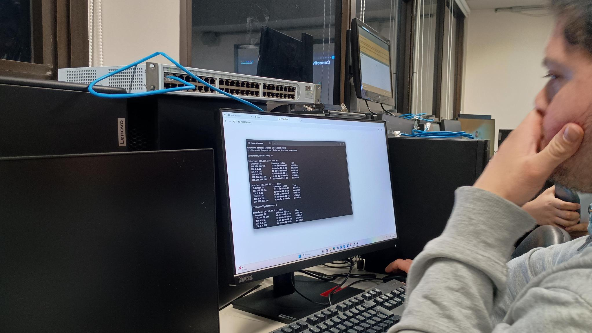
  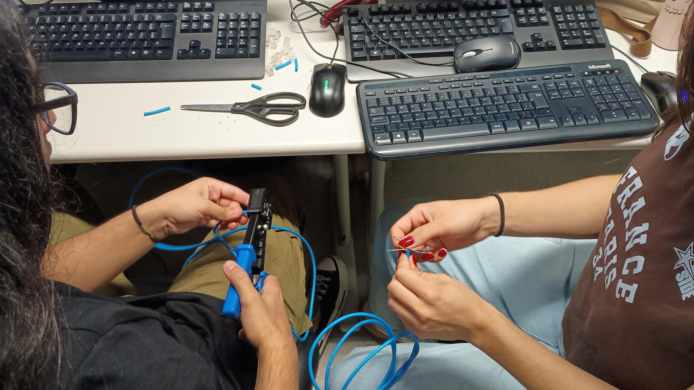

---

### 💿 Fase 2: Instalação, Provisionamento e Resiliência de Hardware
*Instalação limpa dos Sistemas Operacionais nas plataformas físicas. No Windows Server, realização do agrupamento de interfaces de rede via NIC Teaming com as duas placas físicas reais, garantindo tolerância a falhas. Carregamento prévio de drivers controladores (Intel RST) para o pleno reconhecimento dos SSDs de alta performance.*

  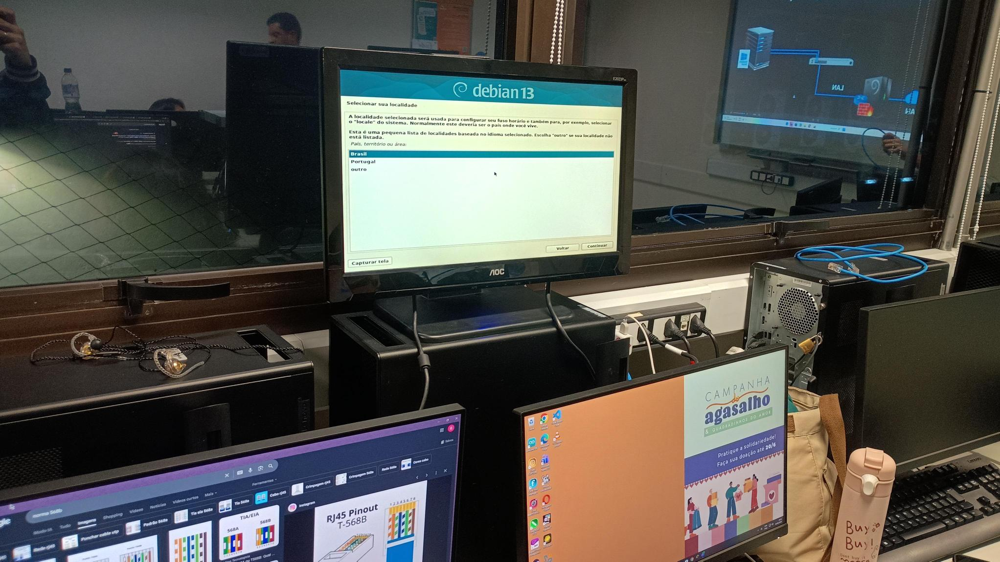
  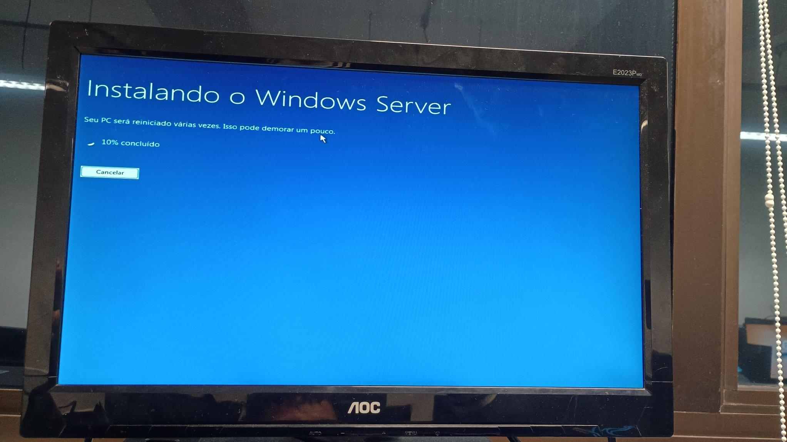

---

### 🔑 Fase 3: Active Directory, Lógica de GPOs e Servidor de Arquivos
*Estruturação lógica do domínio `zetta.local`. Implementação de árvore com mais de 30 GPOs na OU Zetta (incluindo travamento e preenchimento de papel de parede corporativo, logon interativo com aviso de segurança legal e bloqueio de CMD/Executar). Configuração do Servidor de Arquivos com Matriz de Permissões NTFS restritivas por grupos, cotas de disco por usuário, triagem de extensões de arquivos e agendamento automático de backups.*

  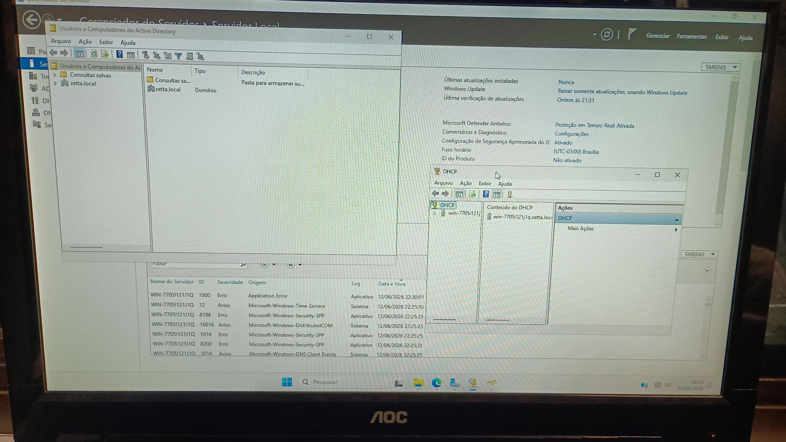
  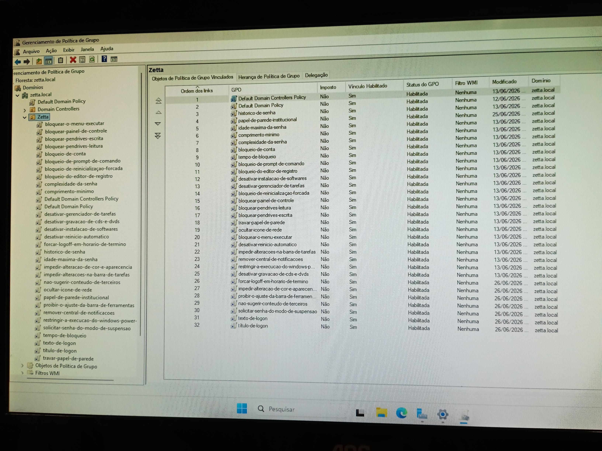

---

### 🧪 Fase 4: Firewall Restritivo, Regras de DNAT e Monitoramento Remoto
*Configuração do Firewall de borda no Debian atuando como gateway da rede, realizando o roteamento de pacotes (NAT) e provendo segurança por regras restritivas do iptables. Implementação do Netdata para monitoramento em tempo real do hardware Linux e liberação do serviço de SSH para gerência remota segura executada a partir do Windows Server.*

  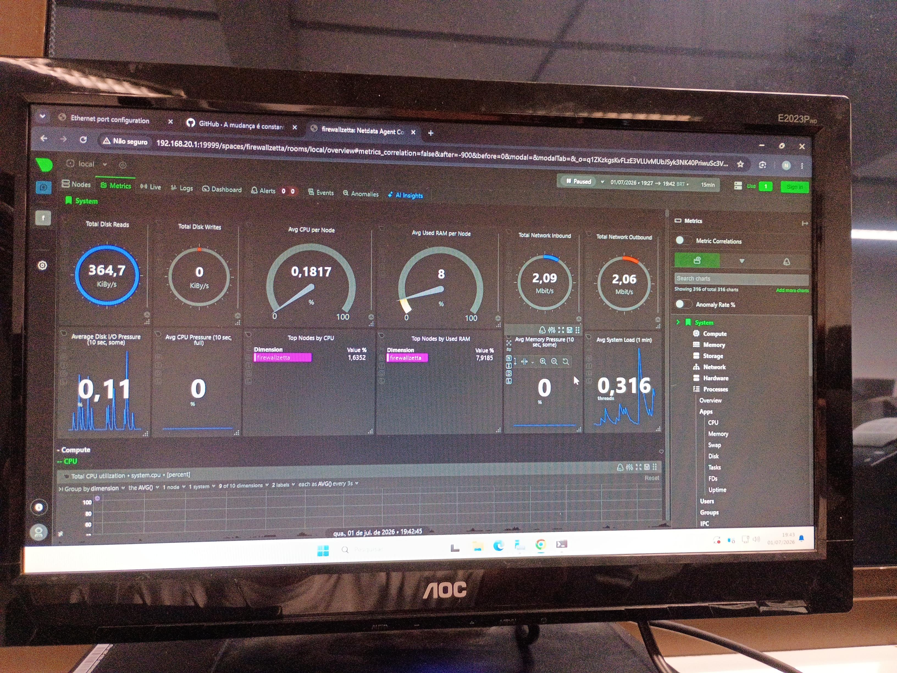

---

### ☕ Fase 5: Servidor de Aplicação Java, Banco de Dados e Contingência
*Hospedagem do sistema de Agenda de Contatos no Servidor Linux de Aplicação rodando Java e Apache Tomcat. Provisionamento do banco de dados MySQL Oracle monitorado via Workbench, com rotinas validadas de simulação de desastre: drop completo da base de dados e restauração imediata do ambiente em produção através de dump SQL.*

  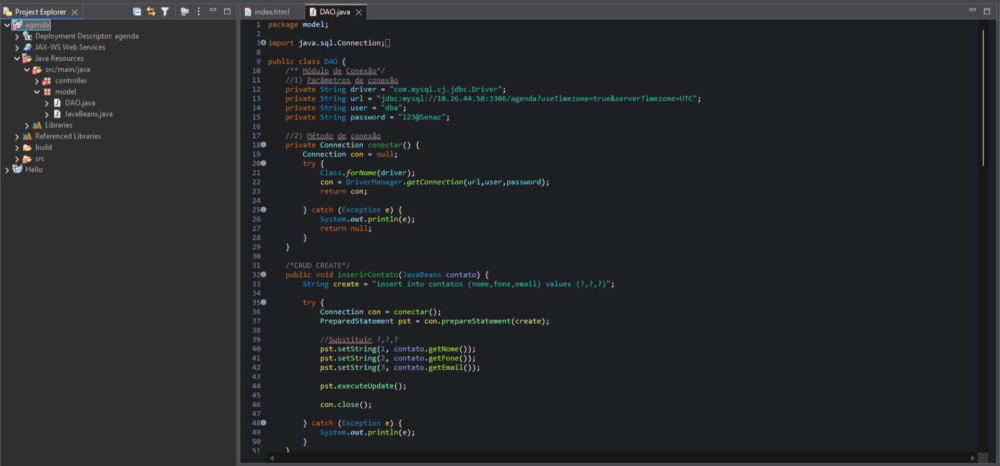
  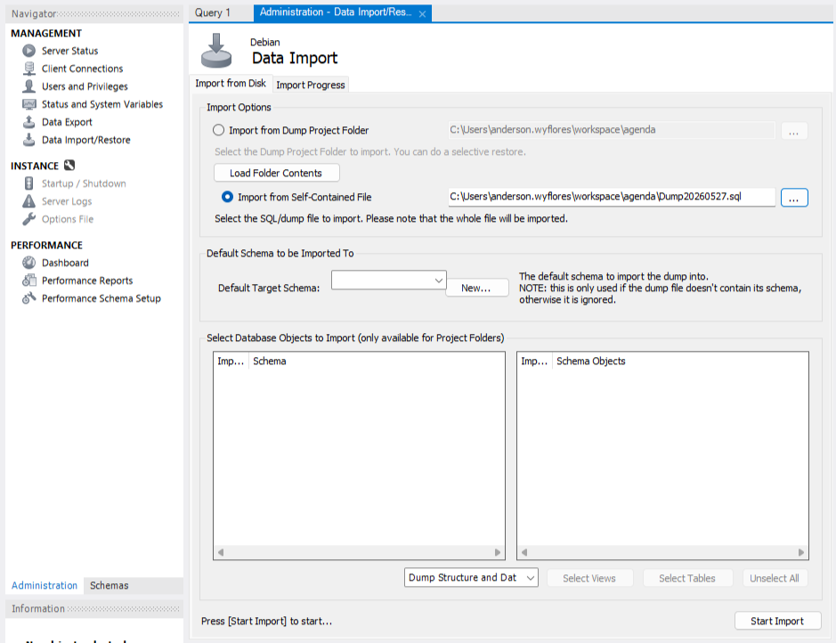
  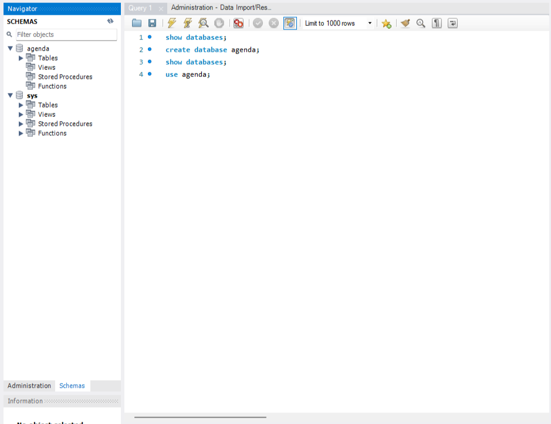

---

### 📡 Fase 6: Integração DHCP, Distribuição Wireless e Homologação Final
*Subida do escopo DHCP ativo do Windows Server distribuindo ranges dinâmicos para hosts e aplicando reservas estáticas de IP para a impressora de rede e para os servidores Linux (Java e WordPress). Integração do roteador físico configurado no modo Access Point isolado para a rede Wi-Fi Corporativa da Zetta.*

  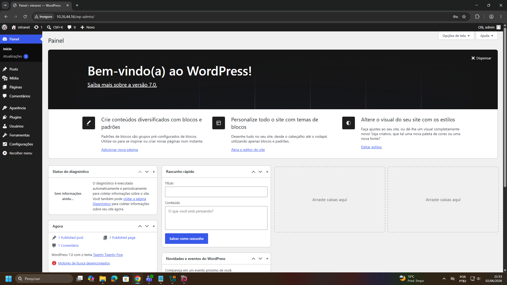

---

### 🖥️ Fase 7: Interceptação de Tráfego e Testes de Conectividade Extremos
*Validação do desafio técnico de interceptação: requisições Web externas para redes sociais e conteúdos indesejados (Porta 80) são capturadas pelo Firewall Debian e redirecionadas via DNAT para o serviço IIS do Windows Server, renderizando de forma forçada a página interna de bloqueio institucional da Zetta. Testes práticos de ping e auditoria de impressão local disparada com sucesso via smartphones e estações de trabalho homologadas.*

  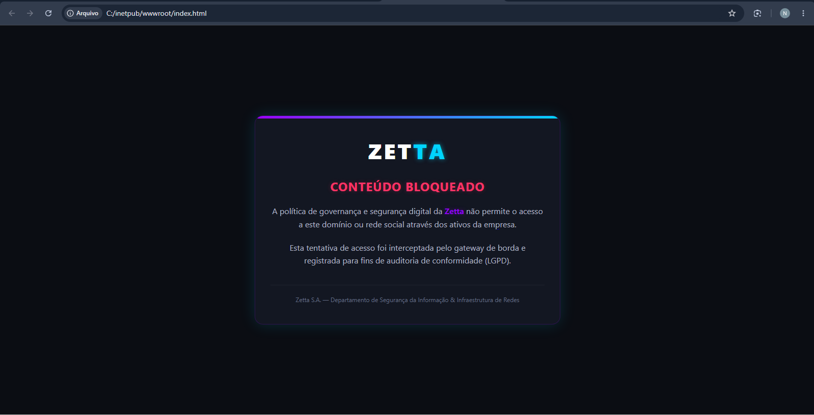
  

